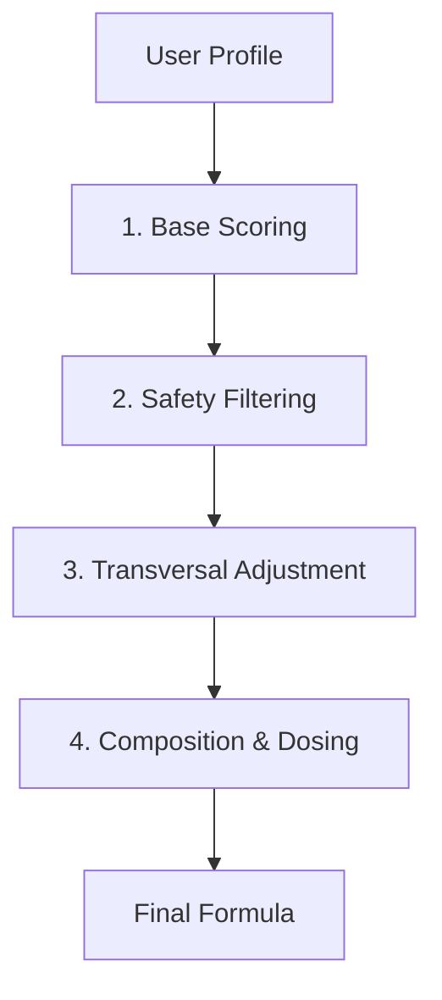

# System Architecture

## Overview
The **Personalized Herbal Formula System** relies on a multi-stage scoring and filtering engine to replicate the decision-making process of an expert herbalist. The system processes a user's biological profile through a precise sequence of logical constraints and adjustments to produce a clinically viable liquid herbal formula.

## The Core Pipeline

The formula generation follows a rigid 4-step linear pipeline:



### 1. Base Scoring
Each plant in the database is evaluated against the user's primary health priorities (e.g., Anxiety, Sleep, Digestion).
- **Metric**: Relevance Score (0-10 scale).
- **Logic**: If a plant has a score for a user's priority, it is added to the plant's total relevance.

### 2. Safety Filtering
The system strictly enforces safety constraints to prevent adverse effects.
- ** Pregnancy**: Excludes plants tagged with `pregnancy_caution`.
- ** Medications**: Excludes plants with `medication_exclude` interactions.
- ** Conditions**: Filters out plants that exacerbate specific conditions (e.g., *Green Tea* is excluded for high anxiety).

### 3. Transversal (Family) Adjustment
To prevent biological redundancy and hypersensitivity reactions, the system limits the number of plants from the same botanical family.
- **Rule 1**: If 2 plants from the same family are selected, the lower-ranked plant receives a **-0.5** score penalty.
- **Rule 2**: If 3 or more plants from the same family appear, the 3rd and subsequent plants are **automatically excluded**.
- **Critical Families**: *Lamiaceae*, *Asteraceae*, *Apiaceae*.

### 4. Automatic Balance & Selection
The final composition is selected to ensure a balanced, synergistic formula that is neither too stimulating nor too sedating.
- **Structure**:
    - **Primary**: 1 Herb (40% of total) – The core driver.
    - **Secondary**: 2 Herbs (20% each) – Supporting similar or complementary actions.
    - **Support**: 1 Herb (20% of total) – Flavor modulation or specific organ support.
- **Balance Rules**:
    - Max **1 Strong Stimulant** (e.g., *Korean Ginseng*).
    - Max **2 Deep Sedatives** (e.g., *Valerian*, *Passionflower*).
    - Must include at least **1 Regulatory** herb (digestive or nervine).

## Data Structure (`plants_db.json`)
The knowledge base is a JSON array of Plant objects:

```json
{
    "name": "Ashwagandha",
    "family": "Solanaceae",
    "role": "primary",
    "attributes": ["adaptogen", "sedative"],
    "constraints": ["pregnancy_caution"],
    "scores": {
        "stress": 9,
        "sleep": 7
    }
}
```
